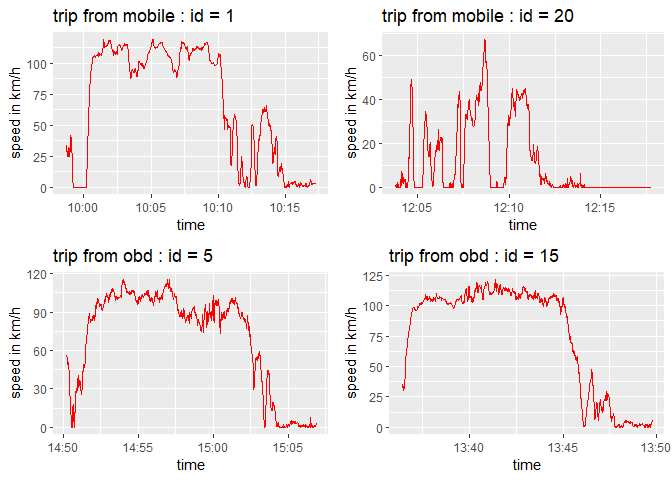
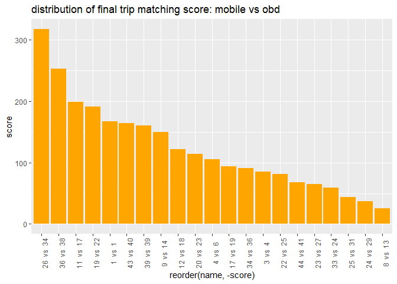
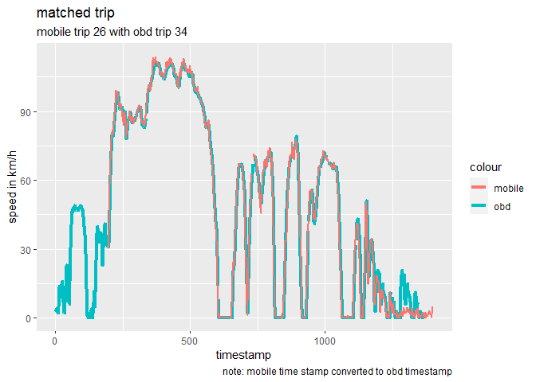
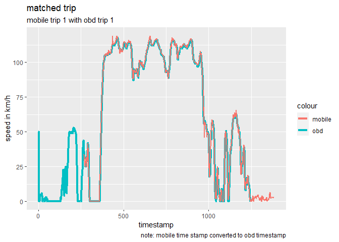
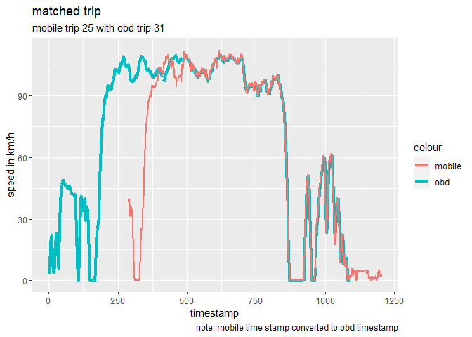

Pair telematics signal between mobile phone and OBD
================

### Problem Statement

Given a set of trip-level sensor datasets collected from a person’s
smart phone, and a set of trip-level sensor datasets collected from an
OBDII device in the same person’s car, figure out which smart phone trip
datasets correspond to which OBDII trip datasets

### Objective

Write an R script that ingests both lists of trips, and automatically
figures out which OBDII trip corresponds to which phone trip, where
“corresponds” means the two trips captured the same driving. The
program need to achieve reasonable accuracy as well as be efficient in
running time and easy to read.

### Deliverable

  - A list containing a 2-element list for each match that was found,
    with the first element of the list being the subset of the OBDII
    trip data frame during the matched interval, and the second element
    of the list being the subset of the mobile trip data frame during
    the matched interval.
  - R script submit by a commit history via Github

### Data Source

  - obd2Trips.RData, a list containing a data frame of vehicle speed
    data for each trip collected from the OBDII plug-in device
  - mobileTrips.RData, a list containing a data frame of smart phone
    speed data for each trip collected from the phone

Below is preview of the mobile trip data(top) and obd trip data(bottom)

    ## 
    ## Attaching package: 'dplyr'

    ## The following objects are masked from 'package:stats':
    ## 
    ##     filter, lag

    ## The following objects are masked from 'package:base':
    ## 
    ##     intersect, setdiff, setequal, union

    ## Loading required package: ggplot2

    ##                                trip_id           timestamp  speed
    ## 1 5305845D-61F4-40EB-BE97-F304DFFD4C36 2017-05-13 09:58:41 33.804
    ## 2 5305845D-61F4-40EB-BE97-F304DFFD4C36 2017-05-13 09:58:42 31.788
    ## 3 5305845D-61F4-40EB-BE97-F304DFFD4C36 2017-05-13 09:58:43 28.980
    ## 4 5305845D-61F4-40EB-BE97-F304DFFD4C36 2017-05-13 09:58:43 29.052
    ## 5 5305845D-61F4-40EB-BE97-F304DFFD4C36 2017-05-13 09:58:44 28.728
    ## 6 5305845D-61F4-40EB-BE97-F304DFFD4C36 2017-05-13 09:58:45 27.072

    ##                trip_id timestamp speed
    ## 1 trip_TAU99985_000000     1.141    50
    ## 2 trip_TAU99985_000000     2.156    50
    ## 3 trip_TAU99985_000000     3.116     0
    ## 4 trip_TAU99985_000000     4.153     0
    ## 5 trip_TAU99985_000000     5.167     0
    ## 6 trip_TAU99985_000000     6.144     0

### Complications

To better visualize the speed variation within a trip to understand the
complication, below are line plots between timestamp and speed change
from sample trips for both obd and phone.

<!-- -->

Following complications are identified:

  - Two sources are not one-to-one matching relationship. A trip from
    one source can have 0 or multiple matched from the other.
  - For a matched trip, the start and end index of the common duration
    from 2 data frames are likely to be different. Not all observations
    of a matched data set are part of the common duration.
  - Inconsistent metrics for both speed and time: This include different
    measure result for a common duration to different units.
  - Noise data exist in various places especially for mobile trip data.

### Methodology

##### 1\. Data cleaning

  - Covert mobile and obd trip from lists format to 2 large data frames,
    where the result data frames is vertical bind of each list element.
  - Normalize speed unit. Convert mobile speed unit from *m/s* to
    *km/hr* to match obd2 data based on observation
  - Convert timestamp unit to datetime format for mobile set.
  - Smooth speed using *loess()* to reduce noise. Although the
    ‘accuracy’ column in mobile dataset is somewhat informative of
    precision, it is not always accurate. The *loess* function smooth
    data by using local polynomial regression fitting is an effective
    way to treat noise data.
  - Remove bad trip data if its maximum speed is less than 10*km/hr* as
    it will be heavily driven by noise.

Note that the final output will retain format of raw input. The change
of formats is for ease of programming.

##### 2\. Split each trip to intervals

The most exhaustive approach to identify common duration is comparing
all matching possibilities. Since the common trip can be any segment of
a trip for both sources, it is not efficient to iterate through and
compare all pairs. Furthermore, this method make result very vulnerable
to noise data.

A more efficient way is to characterize each trip by intervals of speed
going ups and downs, and compare the ‘similarity’ of the intervals. This
can be achieved by comparing aggregated speed and time statistics which
will be introduced later. Compare aggregated interval instead of each
all possible segments is much more efficient in computation time and is
more resistant to noise disturbance.

An interval here is defined as continuous sequence of timestamps with
speed \> 20*km/hr*. The reason why to choose 20 instead of 0 as cutoff
point is there tend to more noise when the vehicle is closer to static.

##### 3\. Calculate interval statistics

An interval will be characterized by following 2 aggregated statistics:

  - The length of interval defined as difference between maximum and
    minimum timestamp
  - Speed value at 10th, 30th, 50th,
    70th, and 90th pecentile

If both statistics are very similar between 2 intervals, they are likely
to be a common interval duration although with rare exceptions. However,
even on aggregated basis, both statistics are still vulnerable to
randomness if there there are few data points in the interval. To
maintain relatively credible result, the intervals with maximum speed of
less \<= 25*km/hr* and time length \<= 40*sec* will be filtered out.

##### 4\. Define interval similarity score

Simularity score is calculated using 3 varibles: **speedMatchScore**,
**lengthDiff** and **lengthMatchInd** defined as follow:

\[speedMatchScore = 1/5 * \sum_{i}^{10, 30, 50, 70, 90}\left(abs(Speed_{mobileIthPercentile} - Speed_{obdIthPercentile} \right))\]

\[lengthDiff = abs(Length_{mobile} - Length_{obd}) / Length_{mobile}\]
\[lengthMatchInd = ifelse(lengthDiff > 0.05, 0, 1)\]

\[intervalMatchScore = e^{ 5 - speedMatchScore - 5 * lengthDiff} * lengthMatchInd\]

The intuition behind definition of the formulas are:

  - Due to measurement error, a common interval can be different in
    speed and time metrics. Using both statistics can correct error
    caused by one metric if the other one is more accurate.  
  - Time difference as opposed to speed is used as baseline standard
    since final score will be 0 if time absolute difference is larger
    than 5%. This is because by intuition that interval length is a more
    “basic metric”. Speed percentile characterize the distribution of
    the speed but can have many variation in shape.  
  - When time difference is less than 5%, more weight will be put onto
    speed difference since it informs the interval more detailed using 5
    data points characterizing speed distribution. This unequal
    contribution rate between time and speed is picked up in the formula
    that ‘speedMatchScore’ is in absolute value but ‘lengthDiff’ is in
    percentage although the latter is multiplied by 10.
  - 5 in *5 - speedMatchScore* is derived using the mind that if average
    speed difference between two is \<5, speed distribution will
    considered close and contribute positively to final score.
    ex will be greater than 1 if *x* \>0.
  - Finally, the formula is in form of exponent instead of simple
    summation. This is because due to randomness, different trip can
    still have intervals similar in 2 statistics. As exponentials have
    derivative much larger than a linear expression when independent
    variable is large, the final score is more sensitive to changes in
    the statistics when the difference is small. Later, trip score will
    be sum of interval score. Using exponents will make two trips with a
    pair of very similar intervals more alike than trips with many less
    similar intervals.

##### 5\. Calculate trip matching result between two sources

After step 3, trip A with 2 intervals and B with 4 intervals will get 8
pairs of matching scores. Then I choose 2 intervals with maximum
matching score. Of course, they will be completely 2 different pairs
that the same interval can not appear in both pairs. The trip match
score will be sum of the 2 interval score.

Iterate through both trips train data, and calculate matching score of
all pairs which will get 44 \* 41 scores. After close comparison between
the trip matching scores and speed plots for each trip, I defined
benchmark of 25. If the trip match score is over 25, then this pair has
a common duration and vice versa.

Below is distribution of final scores selected score indication matched
trips between phone and odb. The score ranges from 25 to 317
<!-- -->

##### 6.Calculate common trip timeframe for each matched trip

For all matched trip pairs, first select the interval with largest
interval matching score. Compare the gap between interval start time and
trip start time between mobile trip and obd2 trip. Interval start time
subtract minimum of the two will be the starting timestamp of common
segment. Use same logic to derive end timestamp of common duration.

Filter the data by begin and end time of common duration for the trips
that had match. Convert two subsets to list of data frames like raw
import.

### Analysis of result

We can better visualize the matched trips in single plots using common
timestamp. Below are some examples.

Below is the pair mobile\_26 vs obd\_34 which returned best matching
result. There are some disagreements in the tails

    ## `summarise()` ungrouping output (override with `.groups` argument)

<!-- -->

Below is the pair ranked number 5 best.

    ## `summarise()` ungrouping output (override with `.groups` argument)

<!-- -->

Here is a pair with lower score rank. The low rank seems to be caused by
inconsistency in time length for the largest interval in the middle. The
mobile phone may fail to capture some motion in this case.

    ## `summarise()` ungrouping output (override with `.groups` argument)

<!-- -->

Another example with low matching score but passed 25 benchmark. In this
case, the signal from phone is much noisier.

    ## `summarise()` ungrouping output (override with `.groups` argument)

<!-- -->

##### Take aways

  - the matching algorithms can well identify the same trip between obd
    and phone
  - signals from phone is overall noisier than that from obd
  - phone detects and records motion overall later than obd

### Potential improvement

One drawback of this algorithm is validation and parameter tuning are
done by eyeballing predictions. There are too many parameters, and it is
likely that they can be further optimized.

With more training data, this can be programmed into a neural network.
Instead of maximizing similarity score, the algorithm can be iteratively
run to minimize a cost function such as 5 - speedSimilarity -
5\*timeSimilarity. Hyperparameters can thus be more optimized.
